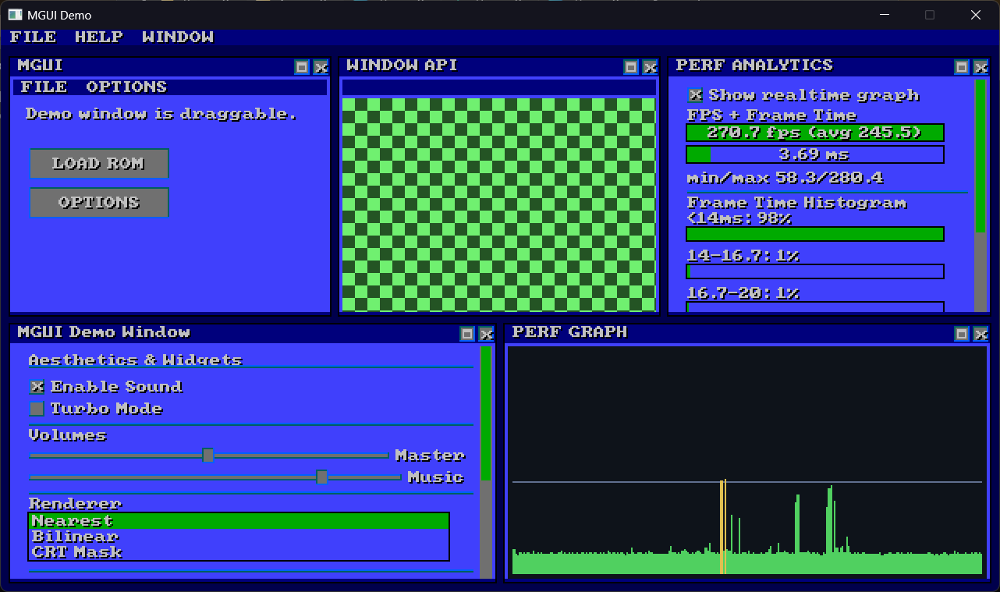

# mdgui

Immediate-mode GUI library (C/C++) with an SDL3 Zig demo application.



## API at a Glance

```c
MDGUI_Input in = { .mouse_x = mx, .mouse_y = my, .mouse_down = down, .mouse_pressed = pressed, .mouse_wheel = wheel };
mdgui_begin_frame(ctx, &in);

if (mdgui_begin_window(ctx, "Debug Panel", 20, 20, 220, 140)) {
  static float volume = 0.6f;
  mdgui_label(ctx, "Audio", 8, 6);
  mdgui_slider(ctx, "Volume", &volume, 0.0f, 1.0f, 8, 6, -16);
  if (mdgui_button(ctx, "Apply", 8, 10, 60, 12)) {
    // handle click
  }
  mdgui_end_window(ctx);
}

mdgui_end_frame(ctx);
```

## Repository Layout

- `include/`: Public headers (`mdgui_c.h`, primitives/font headers)
- `src/`: C/C++ implementation (`mdgui_c.cpp`, `mdgui_glue.cpp`)
- `demo/`: Zig demo app entrypoint (`main.zig`)
- `scripts/release.sh`: Optional helper scripts for POSIX release packaging
- `scripts/release.ps1`: Optional PowerShell helper for Windows release packaging

## Build

Prerequisites:
- Zig `0.15.2` or newer
- C/C++ toolchain supported by your Zig target

Commands:

```sh
zig build
zig build run
```

## Release Packaging (Cross-Platform)

POSIX (Linux/macOS):

```sh
./scripts/release.sh 0.1.0
```

Windows PowerShell:

```powershell
./scripts/release.ps1 release 0.1.0
```

Artifacts:
- Linux/macOS: `mdgui-<version>-<os>-<arch>.tar.gz`
- Windows: `mdgui-<version>-win64.zip`

## Notes

- Window identity is keyed by window title (`mdgui_begin_window` title string).
- For best behavior, keep titles stable across frames.

## Render Backend Compatibility

`mdgui` now uses a pluggable render backend API instead of hard-wiring widget draw calls to SDL renderer APIs.

- Backend-agnostic core primitives/font code: `src/mdgui_glue.cpp`
- SDL compatibility backend implementation: `src/mdgui_backend_sdl.cpp`
- OpenGL compatibility backend adapter: `src/mdgui_backend_opengl.cpp`
- Vulkan compatibility backend adapter: `src/mdgui_backend_vulkan.cpp`
- UI/window logic: `src/mdgui_c.cpp`
- Backend helper declarations: `include/mdgui_backends.h`

```c
MDGUI_Context *ctx = mdgui_create(sdl_renderer);
```

For non-SDL renderers (Vulkan/OpenGL/etc), provide a `MDGUI_RenderBackend` with callback functions and create with:

```c
#include "mdgui_backends.h"

MDGUI_BackendCallbacks callbacks = { ... };
MDGUI_RenderBackend backend = { ... };

// Or use per-backend adapter helpers:
mdgui_make_vulkan_backend(&backend, &callbacks);
// mdgui_make_opengl_backend(&backend, &callbacks);

MDGUI_Context *ctx = mdgui_create_with_backend(&backend);
```

## Credits

**Heavily** inspired by the old Nes Emulator "NESticle" by: Icer Addis
